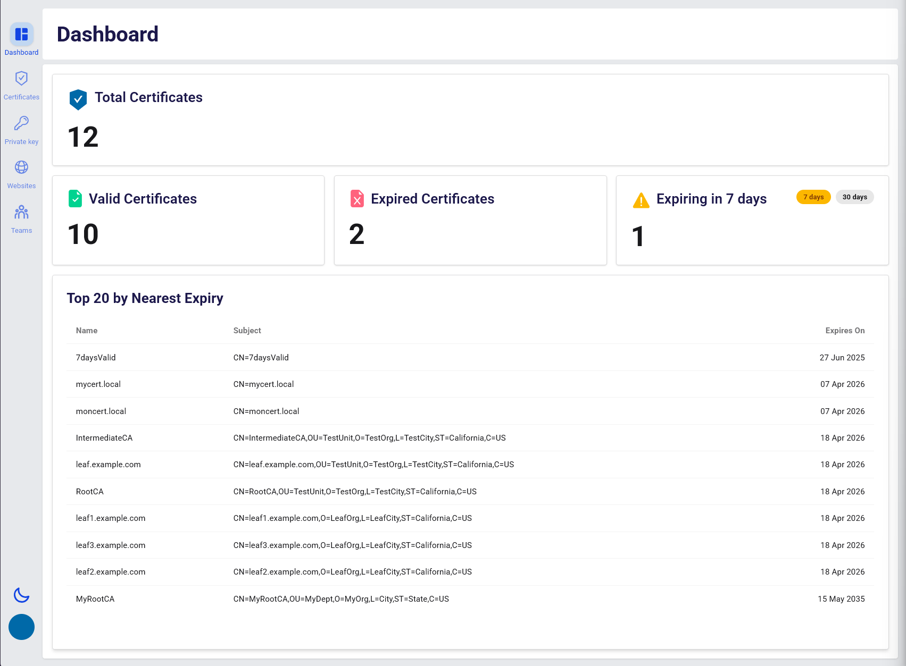
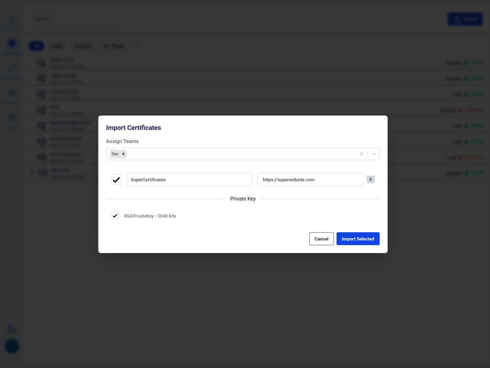
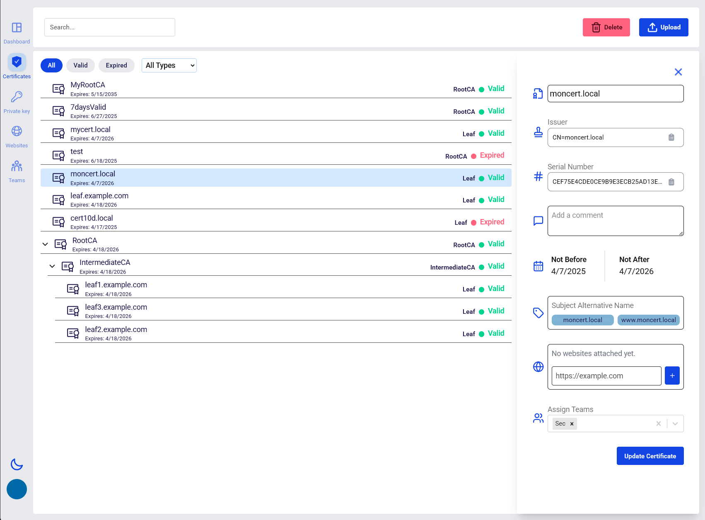

# CerbyonVault



CerbyonVault is a web-based certificate management platform built with Django (backend) and React (frontend). It allows teams to upload, manage, and export SSL/TLS certificates and private keys, with user/team management.

---

## Features

- **Certificate Management:** Upload, view, and export certificates and private keys.

- **Team & User Management:** Assign users to teams, manage permissions.
- **Web UI:** React frontend for easy management.
- **API:** RESTful API for automation and integration.
- **Secure Storage:** Private keys are encrypted at rest.
- **Expiry Tracking:** Track certificate expiry and usage.

- **Dockerized:** Easy deployment with Docker Compose.

---

## Project Structure

```
CerbyonVault/
├── backend/            # Django backend (API, models, admin, etc.)
├── frontend/           # React frontend (UI)
├── certs/              # SSL certificates for Nginx
├── nginx.conf          # Nginx reverse proxy config
├── generate_env.py     # Python script to generate initial env file
├── docker-compose.yml
├── .env                # Environment variables (generated)
```

---

## Getting Started

### 1. Clone the Repository

```sh
git clone https://github.com/cerby0n/CerbyonVault.git
cd cerbyonvault
```

---

### 2. Generate the `.env` File

You can generate a `.env` file using the provided script:

```sh
python generate_env.py
```

This will create a `.env` file with default values.  
**Edit the file** to adjust database credentials, allowed hosts and Django super admin credentials.

---

### 3. Build and Start the Stack

```sh
docker-compose up --build -d
```
---

### 4. Access the Application

- **Default admin user:**  
  Username: `admin`  
  Password: `password`  
  (Set in `.env`) ! Highly recommend to modify all password from the file. Secrets are generated so you do not need to touch them.

- Open [http://localhost](http://localhost) in your browser.

---

### 5. ✅ Configure Certificate Check with Cron

By default, certificate validity is **only checked at upload time**. To ensure certificates are set to expired once validity is past, you can schedule a recurring check (e.g., daily at 2:00 AM). A periodic task is already available — it just needs to be configured.

#### 🛠 Instructions:

1. **Access Django Admin:**
   - Open your browser and go to: [http://localhost/admin](http://localhost/admin)
   - Log in using the **default admin user**.

2. **Create a Crontab Schedule:**
   - In the admin sidebar, go to **Crontabs** → click **"Add Crontab"**
   - Configure your desired schedule:
     - Example: `0 2 * * *` (every day at **2:00 AM**)
     - Select the **timezone** (e.g., `Europe/Zurich`)
     - Click **Save**

3. **Add a Periodic Task:**
   - Go to **Periodic Tasks** → click **"Add Periodic Task"**
   - Fill in the following:
     - **Name:** `Scheduled certificate validity check` (or any name you prefer)
     - **Task:** Select `Check_and_update_expired_certificates` from the dropdown
     - **Schedule:** Choose the crontab schedule you just created
   - Click **Save**

🎉 That’s it! Your system is now set to automatically check certificate validity at your configured time.

---

## Changing from `localhost` to a Custom DNS Name with HTTPS

1. **Edit your `.env` file:**

   - Set `DJANGO_ALLOWED_HOSTS` and `DOMAIN` to your DNS name (e.g., `cerbyonvault.local`).
   - Update `DJANGO_CORS_ALLOWED_ORIGINS` to include your DNS name with `https://`.

2. **Update your hosts file (for local development):**

   - **On Windows:**  
     Edit `C:\Windows\System32\drivers\etc\hosts` and add:
     ```
     127.0.0.1 cerbyonvault.local
     ```

   - **On Linux/macOS:**  
     Edit `/etc/hosts` (you may need `sudo`) and add:
     ```
     127.0.0.1 cerbyonvault.local
     ```

3. **Configure SSL Certificates:**

   - Place your SSL certificate and key in the `certs/` directory as `selfsigned.crt` and `selfsigned.key` (replace them with your own).
   - Update `nginx.conf` if you use different filenames.

4. **Update Frontend API URL:**

   In `frontend/.env`, set:

   ```
   VITE_API_URL=https://cerbyonvault.local/api
   ```

5. **Modify the Nginx.conf file**

Here is an example `nginx.conf` you can use.  
**Note:** If you use certificate files with different names, update the `ssl_certificate` and `ssl_certificate_key` paths accordingly (see comments below).

```nginx
events {}

http {
   server {
      listen 80;
      server_name cerbyonvault.local;
      return 301 https://$host$request_uri;
   }

   server {
      listen      443 ssl;
      server_name cerbyonvault.local;
      include mime.types;
      default_type application/octet-stream;

      # Path to your SSL certificate and key
      # If you use different filenames, update these lines
      ssl_certificate     /etc/nginx/certs/selfsigned.crt;   # <-- Change here if using a custom certificate name
      ssl_certificate_key /etc/nginx/certs/selfsigned.key;   # <-- Change here if using a custom key name

      # Serve static files
      location /static/ {
         alias /static/;
         autoindex off;
      }

      # Serve media files
      location /media/ {
         alias /media/;
         autoindex off;
      }

      # Proxy frontend requests
      location / {
         proxy_pass http://frontend:5173;
         proxy_set_header Host $host;
         proxy_set_header X-Real-IP $remote_addr;
         proxy_set_header X-Forwarded-For $proxy_add_x_forwarded_for;
         proxy_set_header X-Forwarded-Proto $scheme;
      }

      # Proxy backend (admin, API, websockets)
      location ~ ^/(admin|api|ws) {
         proxy_pass http://backend:8000;
         proxy_set_header Host $host;
         proxy_set_header X-Real-IP $remote_addr;
         proxy_set_header X-Forwarded-For $proxy_add_x_forwarded_for;
         proxy_set_header X-Forwarded-Proto $scheme;
      }
   }
}
```


6. **Restart the stack:**

   ```sh
   docker-compose down
   docker-compose up --build
   ```

---

## Notes

- **Static and media files** are handled by Nginx and should not be committed to Git.
- **Production:** For real deployments, use a valid SSL certificate and set `DJANGO_DEBUG=False` in `.env`.
- **Admin Panel:** Django admin is available at `/admin/` (proxied through Nginx).

---

## Troubleshooting

- If you see SSL or connection errors, ensure ports 80 and 443 are exposed and your hosts file is set up.
- If static files are missing, make sure `collectstatic` runs (handled in `entrypoint.sh`).

---

## License

This project is licensed under the [GNU General Public License v3.0 (GPL-3.0)](https://www.gnu.org/licenses/gpl-3.0.en.html).

---

## Contributors

- [Cerby0n](https://github.com/cerby0n)
